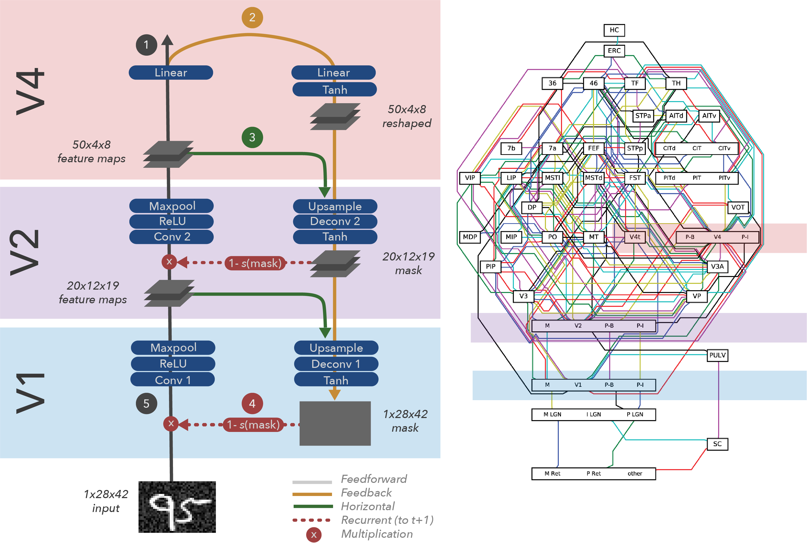
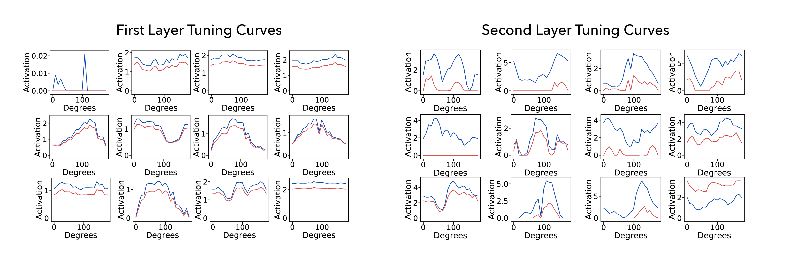
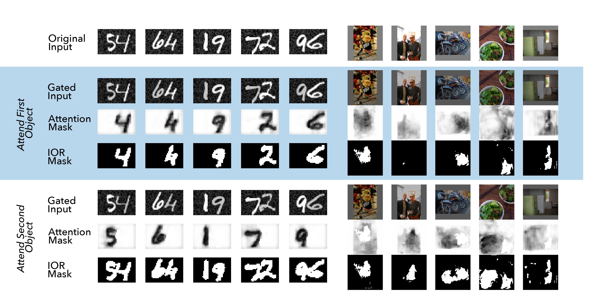

# Object Based Attention Through Internal Gating
Anonymous Authors

## Abstract
Object-based attention is a key component of the visual system, relevant for perception, learning, and memory. Neurons tuned to features of attended objects tend to be more active than those associated with non-attended objects. There is a rich set of models of this phenomenon in computational neuroscience. However, there is currently a divide between models that successfully match physiological data but can only deal with extremely simple problems and models of attention used in computer vision. For example, attention in the brain is known to depend on top-down processing, whereas self-attention in deep learning does not. Here, we propose an artificial neural network model of object-based attention that captures the way in which attention is both top-down and recurrent. Our attention model works well both on simple test stimuli, such as those using images of handwritten digits, and on more complex stimuli, such as natural images drawn from the COCO dataset. We find that our model replicates a range of findings from neuroscience, including attention-invariant tuning, inhibition of return, and attention-mediated scaling of activity. Understanding object based attention is both computationally interesting and a key problem for computational neuroscience. 





# Code
## Dependencies
Dependencies can be found in `requirements.txt`

## Training Code
The code to train the MNIST and COCO models are in `train_mnist.py` and `train_coco.py` respectively. Below are the parameters to run each.

### train_mnist.py
```
python train_mnist.py [flags]
```
* **--device**: cuda device, if one exists. Default 3
* **--n**: number of objects. Default 2
* **--strength**: float representing the strength of attention. Must be between 0.0 and 1.0, inclusive. Default 0.2
* **--noise**: float representing the background noise. Must be between 0.0 and 1.0, inclusive. Default 0.3
* **--name**: string representing the name of the model. Used for saving models and corresponding plots. Default `mnist_model`
* **--epochs**: the number of epochs to run the model. Default 30
* **--randomseed**: set the manual seed. Default 100


### train_coco.py
```
python train_coco.py [flags]
```
* **--trainpath**: REQUIRED path to COCO training images directory. e.g. `../coco_data/coco/images/train2017`
* **--annpath**: REQUIRED path to COCO annotations file. e.g. `../coco_data/coco/annotations/instances_train2017.json`
* **--metadata**: path to COCO metadata file. If this file does not exist, the script will automatically create it in the specified location. Default `data/metadata/cocometadata_train.p`
* **--device**: cuda device, if one exists. Default 3
* **--n**: number of objects. Default 2
* **--strength**: float representing the strength of attention. Must be between 0.0 and 1.0, inclusive. Default 0.9
* **--name**: string representing the name of the model. Used for saving models and corresponding plots. Default `coco_model`
* **--epochs**: the number of epochs to run the model. Default 100
* **--randomseed**: set the manual seed. Default 100

## Evaluation Code
The code to test the MNIST and COCO models are in `test_mnist.py` and `test_coco.py` respectively. Below are the parameters to run each.

### test_mnist.py
```
python test_mnist.py [flags]
```
* **--device**: cuda device, if one exists. Default 3
* **--n**: number of objects. Default 2
* **--strength**: float representing the strength of attention. Must be between 0.0 and 1.0, inclusive. Default 0.2
* **--noise**: float representing the background noise. Must be between 0.0 and 1.0, inclusive. Default 0.3
* **--modelpath**: path to the model to evaluate, a .pt file. Default `saved/models/mnist_model.pt`

### test_coco.py
```
python test_coco.py [flags]
```
* **--testpath**: REQUIRED path to COCO test/validation images directory. e.g. `../coco_data/coco/images/val2017`
* **--annpath**: REQUIRED path to COCO annotations file. e.g. `../coco_data/coco/annotations/instances_val2017.json`
* **--metadata**: REQUIRED path to COCO metadata file. If this file does not exist, the script will automatically create it in the specified location. Default `data/metadata/cocometadata_test.p`
* **--device**: cuda device, if one exists. Default 3
* **--n**: number of objects. Default 2
* **--strength**: float representing the strength of attention. Must be between 0.0 and 1.0, inclusive. Default 0.3
* **--modelpath**: path to the model to evaluate, a .pt file. Default `saved/models/coco_model.pt`

## Pre-trained Modules
* The saved model trained on handwritten digits can be found at `saved/models/paper_mnist_model.pt`. To load: 
```
from models.mnist_model import *
net = Net(strength = 0.2)
net.load_state_dict(torch.load(`saved/models/paper_mnist_model.pt'))
```
* The saved model trained on natural images can be found at `saved/models/paper_coco_model.pt`. To load: 
```
from models.coco_model import *
net = Net(strength = 0.3)
net.load_state_dict(torch.load(`saved/models/paper_coco_model.pt'))
```

## Summary
```
object-based-attention
│   README.md
│   test_coco.py
|   test_mnist.py
|   train_coco.py
|   train_mnist.py    
│
└───analysis
│   │   tuning_curves.py
│   │   graphs.py
│   │   helper.py
│   │   Demo Analysis.ipynb
│   │
│   └───tuning_curves/      (figures)
│   └───graphs/             (figures)
│   
└───data
│   │   coco_loader.py
│   │   mnist_loader.py
│   │
│   └───metadata/           (coco metadata)
│   
└───figures/                (figures from paper)
│   
└───models
│   │   coco_model.py
│   │   mnist_model.py
│   
└───saved
    └───metrics/            (.csv files)
    └───models              (.pt files)
    │   │   paper_mnist_model.pt
    │   │   paper_coco_model.pt    
    │   
    └───plots/              (figures)
```
